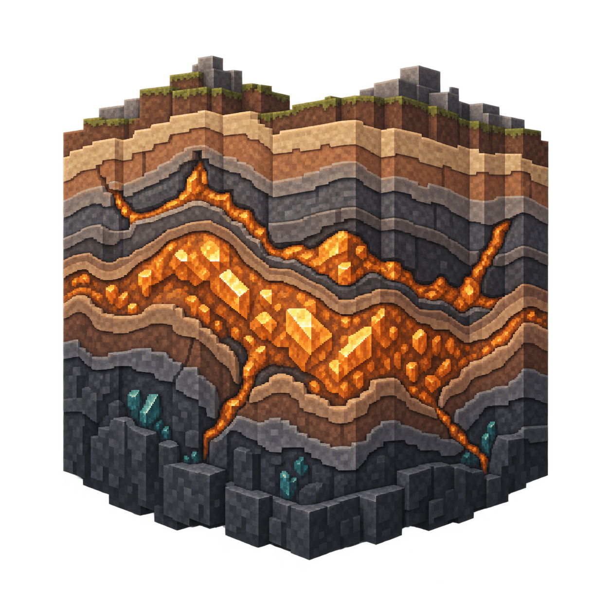

# Realistic Deposits



Realistic Deposits is an extension for
[MMD OreSpawn](https://github.com/MinecraftModDevelopmentMods/OreSpawn) that
is being built to make valuable minerals feel like geological discoveries.
Instead of scattering a steady supply of small, isolated ore clusters
throughout the world, it plans rare formations large enough to reward
exploration and support sprawling mines, rail networks, and long-term resource
projects.

The project starts with Minecraft 1.10.2 and is intended to follow the
maintained OreSpawn branches across Forge and NeoForge.

## Current status

Version `0.1.0.110021` is an early development preview. It can load and
validate deposit definitions, plan deterministic formations, show their bounds
with preview commands, and provide a configuration screen.

It does **not** place or replace blocks yet. Installing this version will not
add massive deposits to generated worlds. This limitation is intentional while
the first generation integration is completed and tested.

## Planned features

- Rare, region-scale deposits that remain identical regardless of chunk
  generation order.
- Long stratiform seams and other geologically inspired bodies instead of
  simply enlarged spherical ore blobs.
- Massive-and-rare, geome-aware, and host-rock-aware generation modes.
- Additive, hybrid, and replacement policies for controlling interaction with
  ordinary ore generation.
- Configurable support for vanilla and modded resources.
- Optional compatibility catalogs for Mineralogy, Base Metals, Modern Metals,
  Base Minerals, and Base Gems where those mods are available.
- Safe generation that avoids air, fluids, bedrock, block entities, structures,
  and undeclared host blocks.

## Requirements

The current branch requires:

- Minecraft 1.10.2;
- Forge 12.18.3.2511 or a compatible newer Forge 12 build;
- MMD OreSpawn 4.0.16 or newer, but earlier than OreSpawn 5;
- Java 8 to run Minecraft.

Realistic Deposits is independent of the similarly themed Large Ore Deposits
mod and does not require it.

## Trying the development preview

Install Forge, OreSpawn, and Realistic Deposits in the usual `mods` directory.
The first launch creates:

```text
config/realisticdeposits/deposits/vanilla.json
```

The supplied definition describes a rare iron formation using a long, thin,
folded `stratiform_seam`. You can inspect the loaded configuration and preview
deterministic candidates with:

```text
/realisticdeposits status
/realisticdeposits preview <regionX> <regionZ> [deposit-id]
/realisticdeposits reload
```

`reload` requires operator permission. These commands are diagnostic only in
the current preview and never change world blocks.

The configuration screen is also available from Forge's Mods list.

## Building from source

The Gradle build runs on Java 17 and compiles the mod for Java 8 using the
configured toolchain. On Windows, run:

```powershell
.\gradlew.bat clean check build
.\gradlew.bat genEclipseRuns
```

Import the project into Eclipse through Buildship after generating the Forge
run configurations.

Bug reports and feature ideas are welcome through the
[issue tracker](https://github.com/MinecraftModDevelopmentMods/RealisticDeposits/issues).

## Links

- [CurseForge project](https://www.curseforge.com/minecraft/mc-mods/realisticdeposits)
- [MMD OreSpawn](https://github.com/MinecraftModDevelopmentMods/OreSpawn)
- [Source repository](https://github.com/MinecraftModDevelopmentMods/RealisticDeposits)

## License

Realistic Deposits is licensed under the
[GNU Lesser General Public License version 2.1](LICENSE).
